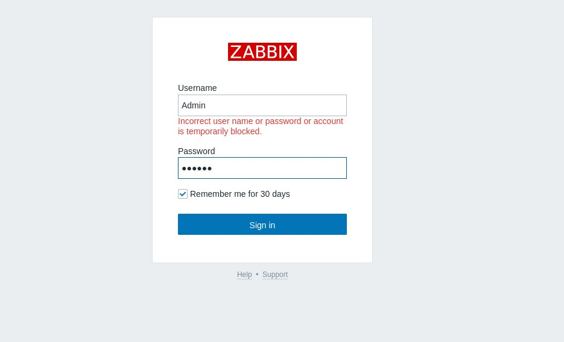
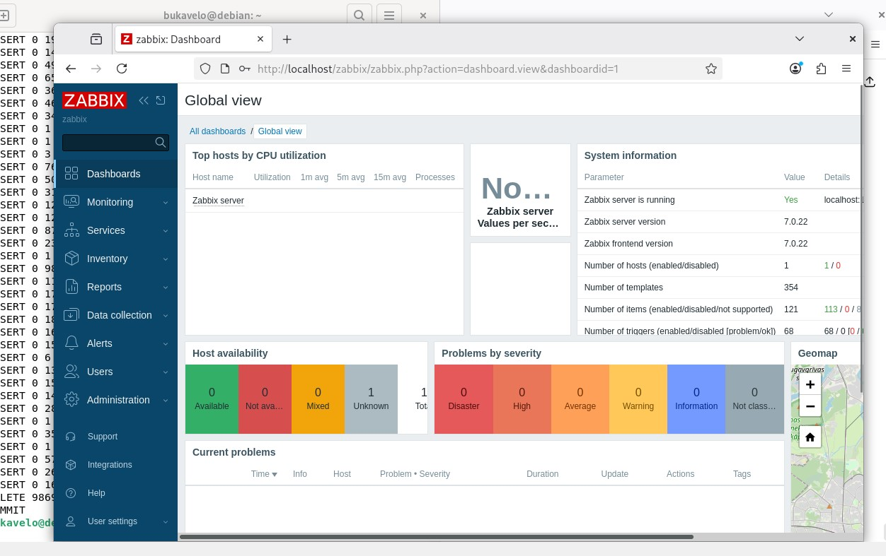
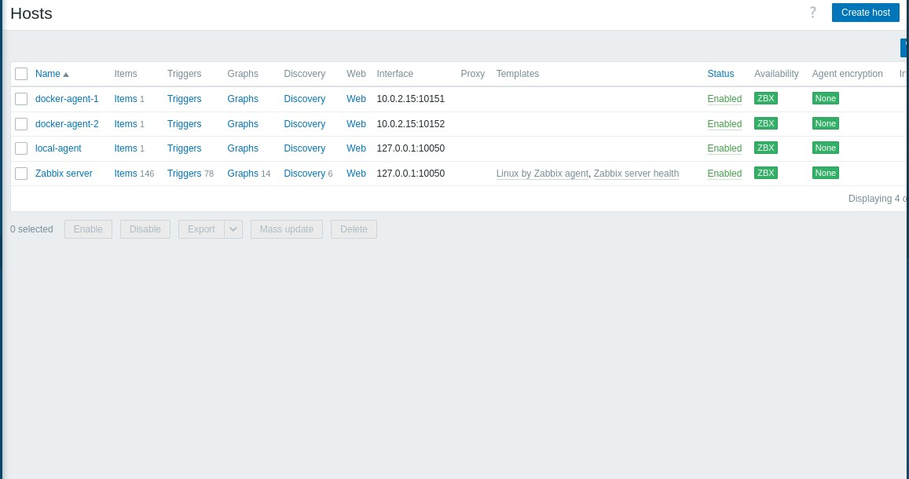
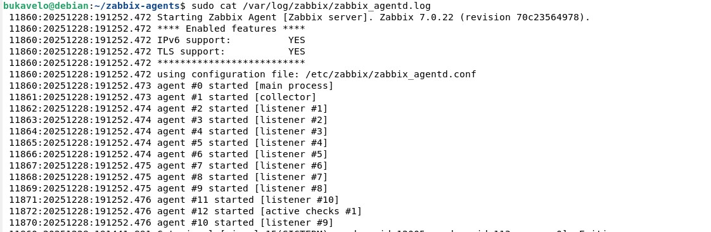
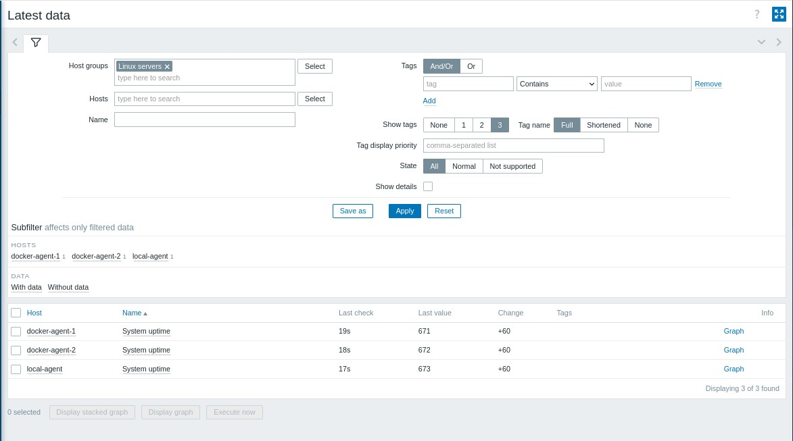
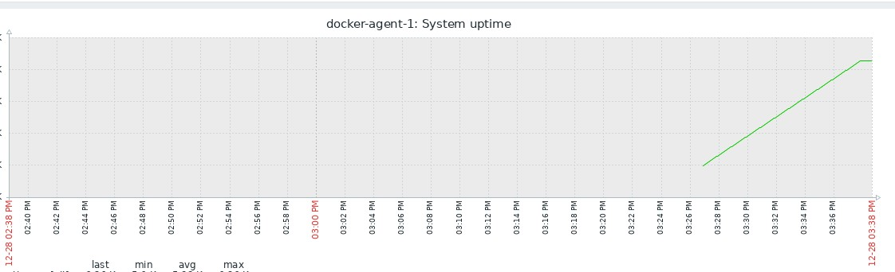
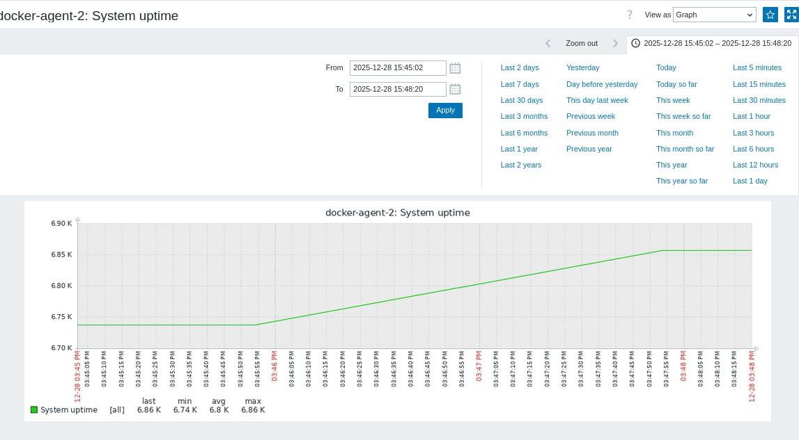
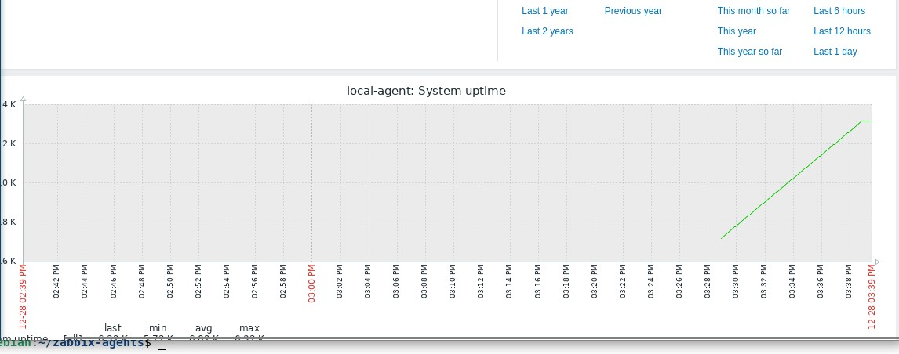

# Домашнее задание к занятию "`Система мониторинга Zabbix`" - `Букавело Алексей`

### Инструкция по выполнению домашнего задания

1.  Сделайте `fork` данного репозитория к себе в Github и переименуйте его по названию или номеру занятия, например, https://github.com/имя-вашего-репозитория/git-hw или https://github.com/имя-вашего-репозитория/7-1-ansible-hw).
2.  Выполните клонирование данного репозитория к себе на ПК с помощью команды `git clone`.
3.  Выполните домашнее задание и заполните у себя локально этот файл README.md:
    - впишите вверху название занятия и вашу фамилию и имя
    - в каждом задании добавьте решение в требуемом виде (текст/код/скриншоты/ссылка)
    - для корректного добавления скриншотов воспользуйтесь [инструкцией "Как вставить скриншот в шаблон с решением](https://github.com/netology-code/sys-pattern-homework/blob/main/screen-instruction.md)
    - при оформлении используйте возможности языка разметки md (коротко об этом можно посмотреть в [инструкции по MarkDown](https://github.com/netology-code/sys-pattern-homework/blob/main/md-instruction.md))
4.  После завершения работы над домашним заданием сделайте коммит (`git commit -m "comment"`) и отправьте его на Github (`git push origin`);
5.  Для проверки домашнего задания преподавателем в личном кабинете прикрепите и отправьте ссылку на решение в виде md-файла в вашем Github.
6.  Любые вопросы по выполнению заданий спрашивайте в чате учебной группы и/или в разделе “Вопросы по заданию” в личном кабинете.

Желаем успехов в выполнении домашнего задания!

### Дополнительные материалы, которые могут быть полезны для выполнения задания

1. [Руководство по оформлению Markdown файлов](https://gist.github.com/Jekins/2bf2d0638163f1294637#Code)

---

### Задание 1

Установите Zabbix Server с веб-интерфейсом.

Процесс выполнения
Выполняя ДЗ, сверяйтесь с процессом отражённым в записи лекции.
Установите PostgreSQL. Для установки достаточна та версия, что есть в системном репозитороии Debian 11.
Пользуясь конфигуратором команд с официального сайта, составьте набор команд для установки последней версии Zabbix с поддержкой PostgreSQL и Apache.
Выполните все необходимые команды для установки Zabbix Server и Zabbix Web Server.
Требования к результатам
Прикрепите в файл README.md скриншот авторизации в админке.
Приложите в файл README.md текст использованных команд в GitHub.

---

Команды:
```bash
sudo apt install postgresql postgresql-contrib -y
wget https://repo.zabbix.com/zabbix/7.0/debian/pool/main/z/zabbix-release/zabbix-release_7.0-1+debian12_all.deb
sudo dpkg -i zabbix-release_7.0-1+debian12_all.deb
sudo apt update
sudo apt install zabbix-server-pgsql zabbix-frontend-php zabbix-apache-conf zabbix-sql-scripts curl nano -y
sudo -u postgres createuser --pwprompt zabbix
sudo -u postgres createdb -O zabbix zabbix
sudo zcat /usr/share/zabbix-sql-scripts/postgresql/server.sql.gz | sudo -u zabbix psql zabbix
sudo nano /etc/zabbix/zabbix_server.conf
#DBPassword=zabbix
sudo systemctl restart zabbix-server apache2 postgresql
sudo systemctl enable zabbix-server apache2 postgresql
sudo -u postgres psql zabbix -c "UPDATE users SET passwd=md5('zabbix') WHERE username='Admin';"
curl http://localhost/zabbix
sudo systemctl status zabbix-server
```
---




### Задание 2

Задание 2
Установите Zabbix Agent на два хоста.

Процесс выполнения
Выполняя ДЗ, сверяйтесь с процессом отражённым в записи лекции.
Установите Zabbix Agent на 2 вирт.машины, одной из них может быть ваш Zabbix Server.
Добавьте Zabbix Server в список разрешенных серверов ваших Zabbix Agentов.
Добавьте Zabbix Agentов в раздел Configuration > Hosts вашего Zabbix Servera.
Проверьте, что в разделе Latest Data начали появляться данные с добавленных агентов.
Требования к результатам
Приложите в файл README.md скриншот раздела Configuration > Hosts, где видно, что агенты подключены к серверу
Приложите в файл README.md скриншот лога zabbix agent, где видно, что он работает с сервером
Приложите в файл README.md скриншот раздела Monitoring > Latest data для обоих хостов, где видны поступающие от агентов данные.
Приложите в файл README.md текст использованных команд в GitHub

---

Команды:
```bash
sudo apt install docker.io docker-compose -y
sudo usermod -aG docker $USER
newgrp docker
sudo systemctl start docker
sudo systemctl enable docker
mkdir ~/zabbix-agents
cd ~/zabbix-agents
nano docker-compose.yml
  services:
  agent1:
    image: zabbix/zabbix-agent:alpine-7.0-latest
    container_name: zabbix-agent-1
    restart: unless-stopped
    environment:
      ZBX_HOSTNAME: "docker-agent-1"
      ZBX_SERVER_HOST: "10.0.2.15"
    ports:
      - "10151:10050"

  agent2:
    image: zabbix/zabbix-agent:alpine-7.0-latest
    container_name: zabbix-agent-2
    restart: unless-stopped
    environment:
      ZBX_HOSTNAME: "docker-agent-2"
      ZBX_SERVER_HOST: "10.0.2.15"
    ports:
      - "10152:10050"
docker-compose up -d
sudo apt install zabbix-agent -y
sudo nano /etc/zabbix/zabbix_agentd.conf
#Server=127.0.0.1,10.0.2.15
#ServerActive=127.0.0.1,10.0.2.15
sudo systemctl restart zabbix-agent
sudo systemctl enable zabbix-agent
sudo zabbix_get -s 127.0.0.1 -p 10050 -k "system.uptime"
sudo zabbix_get -s 10.0.2.15 -p 10151 -k "system.uptime"
sudo zabbix_get -s 10.0.2.15 -p 10152 -k "system.uptime"
sudo netstat -tlnp | grep :10050
sudo netstat -tlnp | grep :10151
sudo netstat -tlnp | grep :10152
sudo tail -20 /var/log/zabbix/zabbix_agentd.log
docker-compose logs --tail=20
```
---

1.



2.



3.





