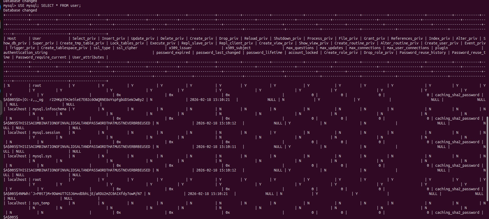
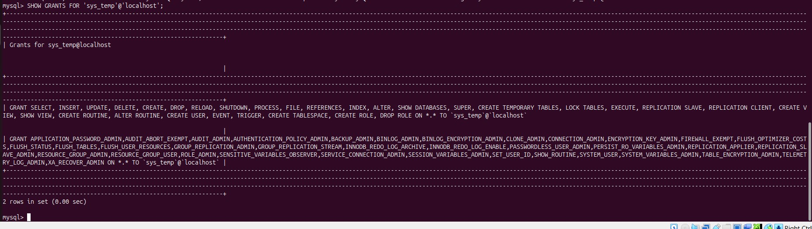
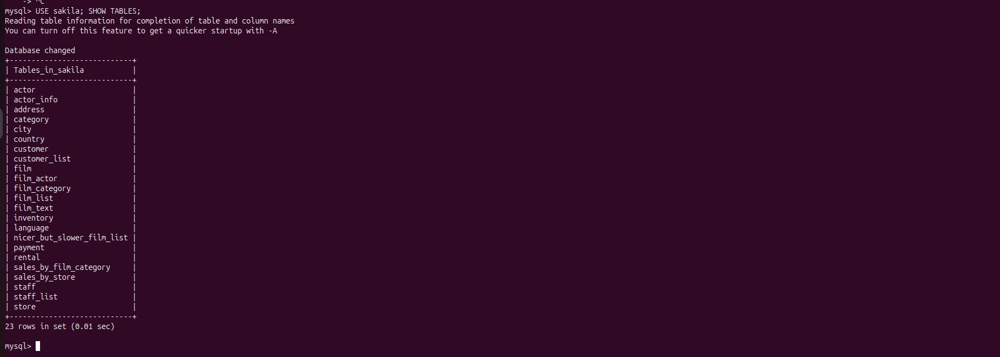
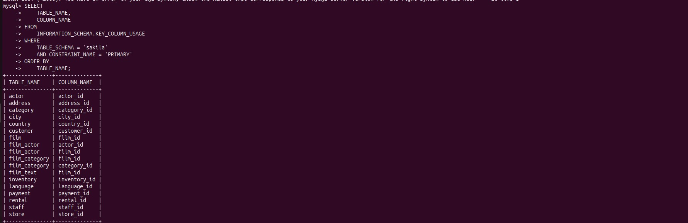

# Домашнее задание к занятию "`Работа с данными (DDL/DML)`" - `Букавело Алексей`


### Задание 1
1.1. Поднимите чистый инстанс MySQL версии 8.0+. Можно использовать локальный сервер или контейнер Docker.

1.2. Создайте учётную запись sys_temp.

1.3. Выполните запрос на получение списка пользователей в базе данных. (скриншот)



1.4. Дайте все права для пользователя sys_temp.

1.5. Выполните запрос на получение списка прав для пользователя sys_temp. (скриншот)



1.6. Переподключитесь к базе данных от имени sys_temp.

Для смены типа аутентификации с sha2 используйте запрос:

```sql
ALTER USER 'sys_test'@'localhost' IDENTIFIED WITH mysql_native_password BY 'password';
```
1.6. По ссылке https://downloads.mysql.com/docs/sakila-db.zip скачайте дамп базы данных.

1.7. Восстановите дамп в базу данных.

1.8. При работе в IDE сформируйте ER-диаграмму получившейся базы данных. При работе в командной строке используйте команду для получения всех таблиц базы данных. (скриншот)




### Задание 2
Составьте таблицу, используя любой текстовый редактор или Excel, в которой должно быть два столбца: в первом должны быть названия таблиц восстановленной базы, во втором названия первичных ключей этих таблиц. Пример: (скриншот/текст)
```
Название таблицы | Название первичного ключа
customer         | customer_id
```

Дополнительно вывод таблиц и их ключей файле primary-key.xlsx




### Команды
В терминале:
```bash
docker run --name mysql-admin -e MYSQL_ROOT_PASSWORD=admin -p 3306:3306 -d mysql:8.0
docker exec -it mysql-admin mysql -u root -p
```
В mysql:
```sql
CREATE USER 'sys_temp'@'localhost' IDENTIFIED BY 'temppass';
USE mysql; SELECT * FROM user;
GRANT ALL PRIVILEGES ON *.* TO 'sys_temp'@'localhost';
SHOW GRANTS FOR 'sys_temp'@'localhost';
ALTER USER 'sys_temp'@'localhost' IDENTIFIED WITH mysql_native_password BY 'usertemppass';
exit
```
В терминале:
```bash
docker exec -it mysql-admin mysql -u sys_temp -p
docker exec -i mysql-admin mysql -u sys_temp -pusertemppass < /home/bukavelo-alexey-aleksandrovich/sakila-db/sakila-schema.sql
docker exec -i mysql-admin mysql -u sys_temp -pusertemppass < /home/bukavelo-alexey-aleksandrovich/sakila-db/sakila-data.sql
```
В mysql:
```sql
USE sakila; SHOW TABLES;
mysql> SELECT
    ->     TABLE_NAME,
    ->     COLUMN_NAME
    -> FROM
    ->     INFORMATION_SCHEMA.KEY_COLUMN_USAGE
    -> WHERE
    ->     TABLE_SCHEMA = 'sakila'
    ->     AND CONSTRAINT_NAME = 'PRIMARY'
    -> ORDER BY
    ->     TABLE_NAME;
```
