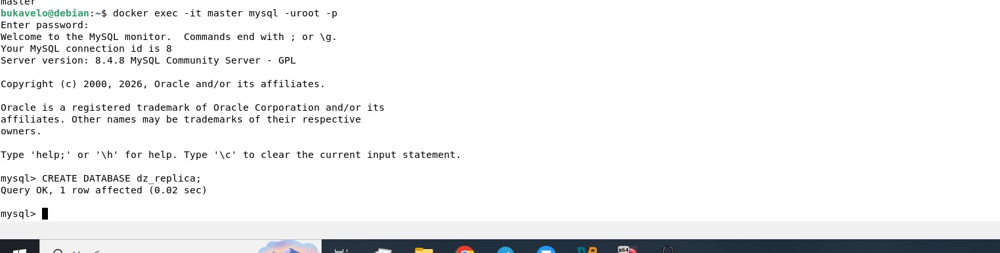
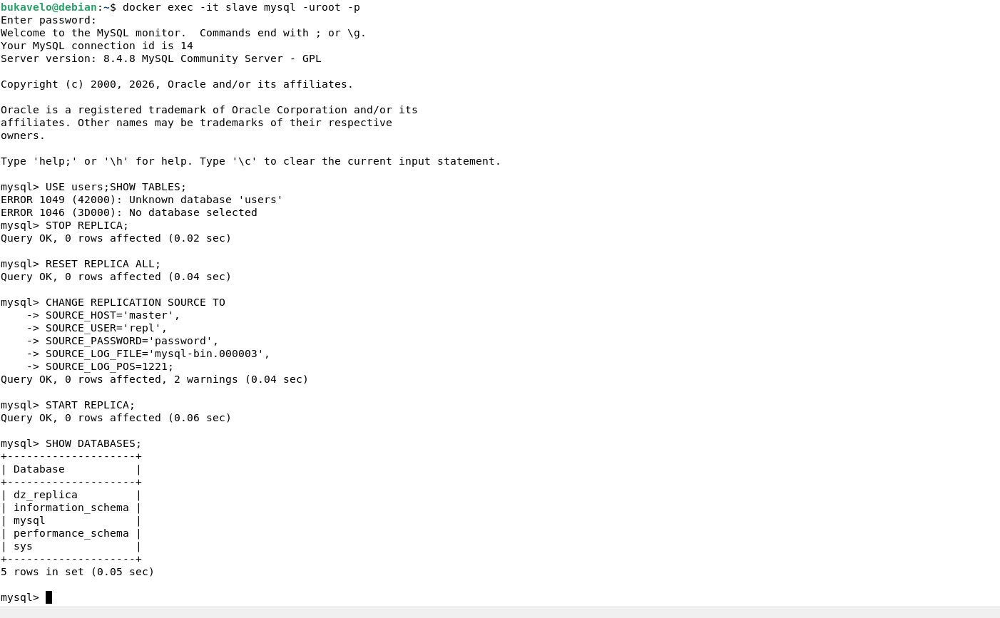
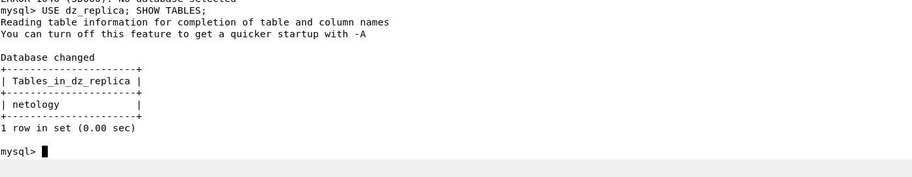
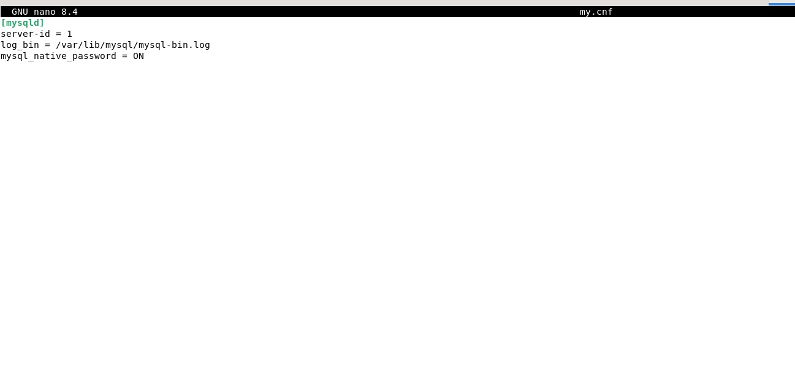
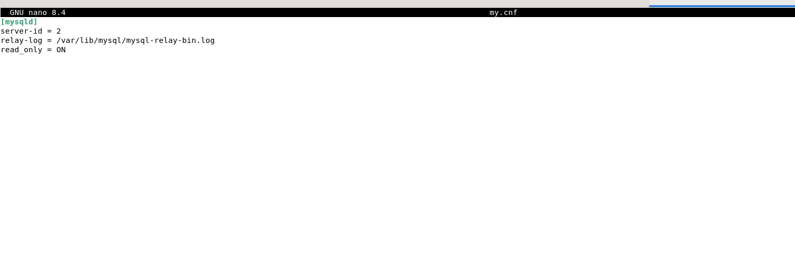
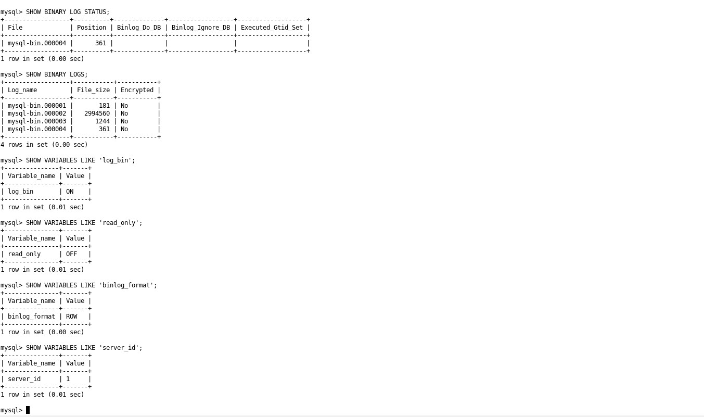
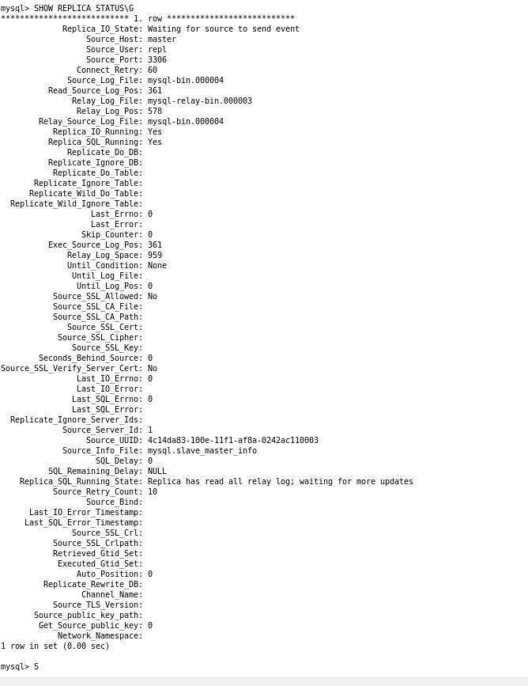
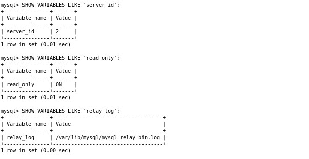

# Домашнее задание к занятию "`Репликация и масштабирование. Часть 1`" - `Букавело Алексей`

### Задание 1
На лекции рассматривались режимы репликации master-slave, master-master, опишите их различия.

В Master-Slave один сервер главный master - он принимает все записи, а второй подчиненный slave - только читает данные и копирует изменения с мастера. Запись идет только на мастер, чтение можно делать с обоих.

В Master-Master оба сервера могут и писать и читать. Они оба главные и копируют изменения друг друга. Это сложнее потому что могут быть конфликты если одновременно писать в одно место на обоих серверах.

### Задание 2
Выполните конфигурацию master-slave репликации, примером можно пользоваться из лекции.

ВЫПОЛЕНИЕ РАБОТЫ:
master:

КОНФИГУРАЦИЯ:
master:

slave:

РЕЖИМ РАБОТЫ СЕРВЕРОВ:
master:

slave:

