# Домашнее задание к занятию "`Оркестрация группой Docker контейнеров на примере Docker Compose`" - `Букавело Алексей`

### Задание 1
https://hub.docker.com/repository/docker/bukvalni/custom-nginx/general

### Задание 2

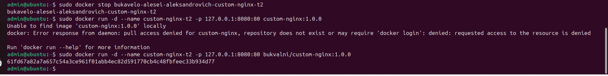
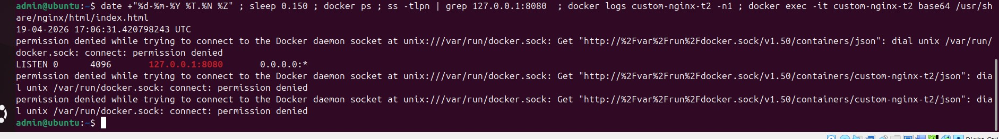

### Задание 3

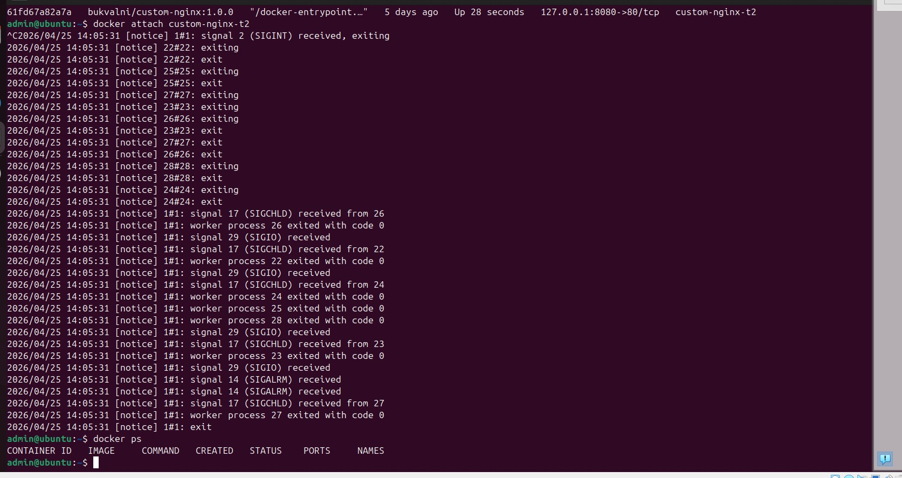

Контейнер использует nginx в качестве главного процесса (PID 1). Комбинация Ctrl+C отправляет сигнал SIGINT этому процессу. Nginx завершает свою работу, и поскольку это был единственный главный процесс, контейнер тоже останавливается

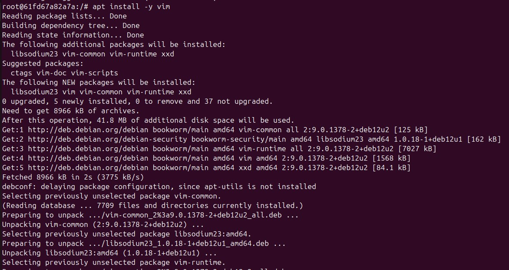

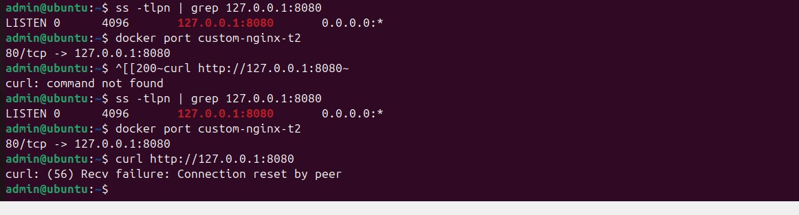

При создании контейнера мы пробросили порт 8080 хоста на 80 внутри контейнера (-p 8080:80). Когда мы поменяли listen 80 на 81, nginx перестал слушать 80-й порт, но проброс остался старым. Docker всё ещё направляет трафик с localhost:8080 на порт 80 контейнера, где никто не слушает, поэтому запрос зависает и возвращает ошибку

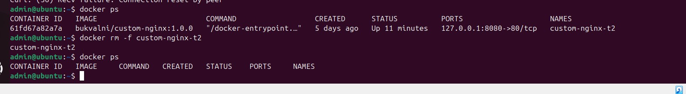

### Задание 4

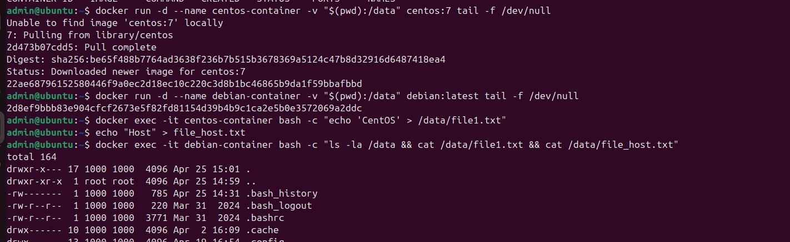

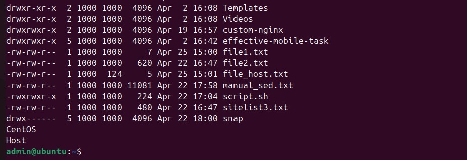

### Задание 5
1.При выполнении команды docker compose up -d в директории, где одновременно находятся файлы compose.yaml и docker-compose.yaml, запустится только compose.yaml. Утилита Docker Compose имеет жестко заданный приоритет имен файлов compose.yaml — самый высокий приоритет

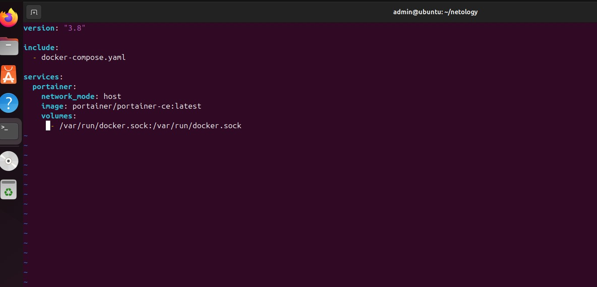

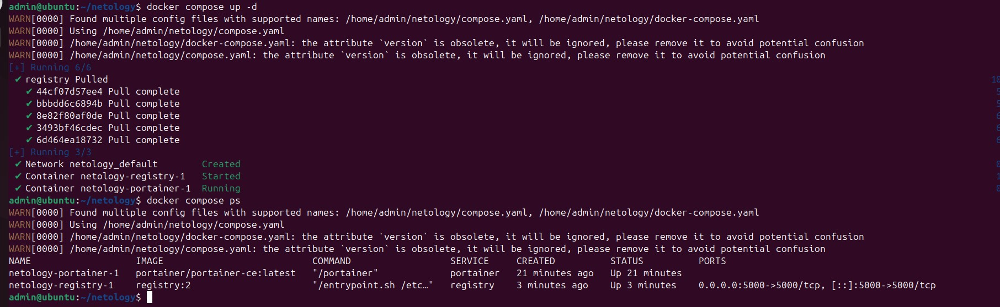

.jpg)

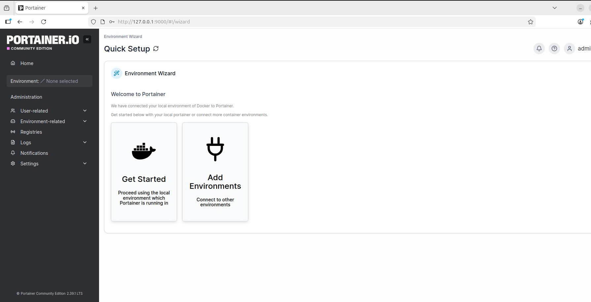

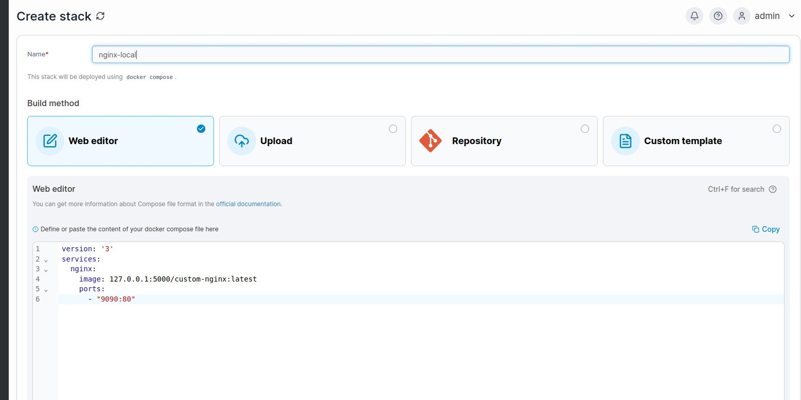

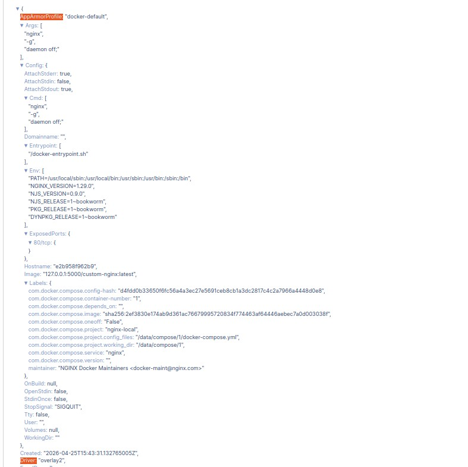

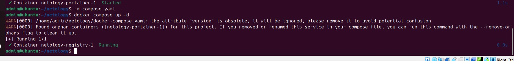

В папке больше нет описания сервиса portainer, но сам контейнер в системе всё ещё запущен. Docker считает его сиротой

